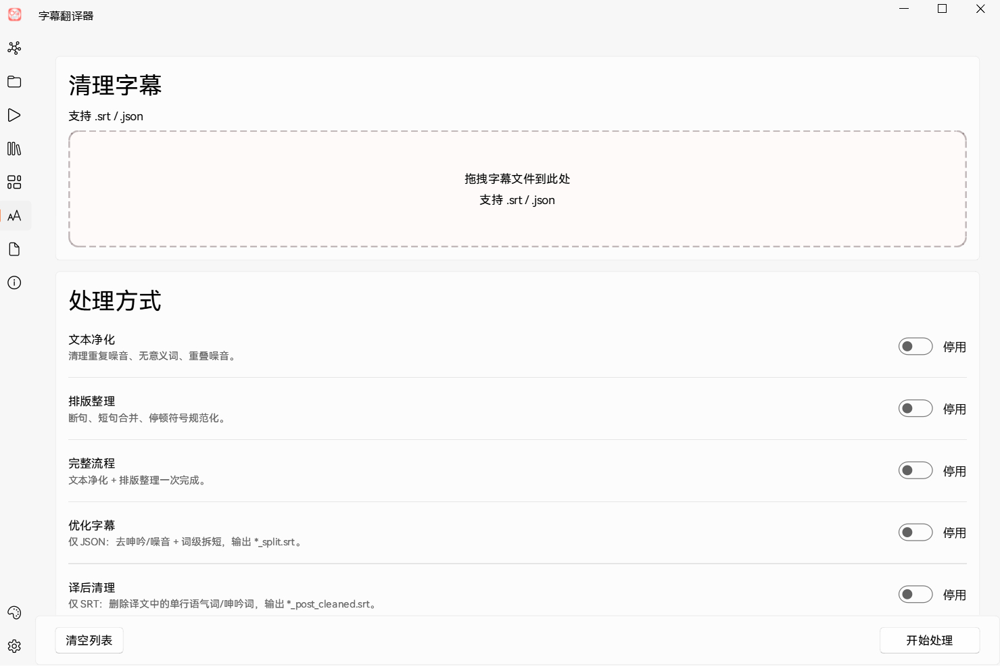
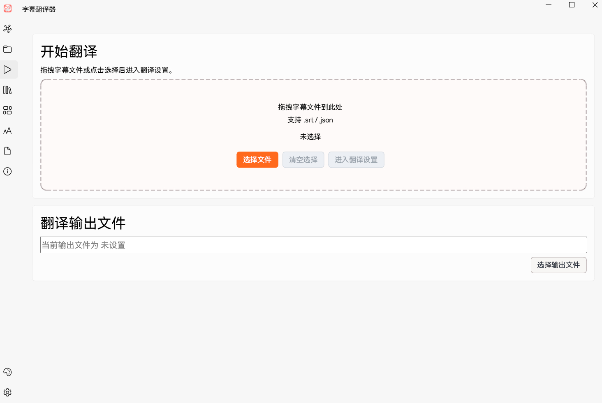

# SubtitleTranslator - AI 字幕翻译工具

基于 AI 大语言模型（LLM）的字幕翻译工具，支持多种主流 API 接口，提供语义分段、批量翻译、并发优化等功能。

## 界面截图


*翻译任务管理与配置界面*


*API 接口与模型选择设置*

## 功能特性

- **多 API 支持**：集成 OpenAI、Anthropic Claude、阿里云通义千问、百度文心一言、智谱 GLM、DeepSeek、Moonshot 等
- **自定义 API**：支持添加任意 OpenAI 兼容的 API 端点
- **语义分段**：基于 AI 的智能字幕分段，提升翻译质量
- **批量翻译**：支持大批量字幕文件的自动翻译
- **并发优化**：智能并发控制，充分利用 API 配额
- **速率限制**：内置速率限制器，避免触发 API 频率限制
- **代理支持**：支持 HTTP/HTTPS 代理
- **流式翻译**：支持流式 API 响应，避免网关超时
- **断点续跑**：支持翻译任务中断后恢复
- **多种提示词模板**：内置标准翻译、专业翻译、口语化翻译等模式
- **可视化界面**：基于 PyQt6 的图形用户界面

## 系统要求

- Python 3.10+
- 至少一个 AI API 的访问密钥

## 快速开始

### 1. 安装依赖

```bash
pip install -r requirements.txt
```

### 2. 启动程序

直接双击 `start_v2.bat`，或在终端运行：

```bash
python subtitle_translator_gui_v2.pyw
```

### 3. 配置 API

在程序界面中添加你的 API 密钥并选择模型即可开始翻译。

## 项目结构

```
SubtitleTranslator/
├── start_v2.bat                    # 启动脚本
├── subtitle_translator_gui_v2.pyw  # 主程序入口
├── config/
│   ├── api_providers.json          # API 接口配置模板
│   ├── custom_providers.json       # 自定义接口配置（运行时生成）
│   ├── system_prompts.json         # 翻译提示词模板
│   └── theme.json                  # 界面主题配置
├── modules/
│   ├── api_manager.py              # API 管理器
│   ├── config_manager.py           # 配置管理器
│   ├── config_migration.py         # 配置迁移工具
│   ├── config_paths.py             # 配置路径工具
│   ├── custom_provider_manager.py  # 自定义接口管理器
│   ├── rate_limiter.py             # 速率限制器
│   ├── segmentation_engine.py      # 语义分段引擎
│   ├── segmentation_post_processor.py
│   ├── segmentation_workflow.py
│   ├── semantic_exporter.py
│   ├── semantic_llm_refiner.py
│   ├── semantic_llm_requester.py
│   ├── semantic_llm_validator.py
│   ├── semantic_models.py
│   ├── semantic_patterns.py
│   ├── semantic_pipeline.py
│   ├── semantic_risk_detector.py
│   ├── semantic_rule_engine.py
│   ├── srt_parser.py               # SRT 文件解析器
│   ├── subtitle_cleaner.py         # 字幕清理器
│   ├── subtitle_merge.py           # 字幕合并工具
│   ├── translation_state_manager.py
│   ├── translator.py               # 翻译引擎核心
│   └── whisper_json_loader.py
├── app/
│   ├── __init__.py
│   ├── ui/                         # 用户界面模块
│   │   ├── main_window.py
│   │   ├── settings_page.py
│   │   ├── task_page.py
│   │   ├── providers_page.py
│   │   ├── prompts_page.py
│   │   ├── theme_page.py
│   │   ├── ... (其他 UI 组件)
│   └── services/                   # 后台服务模块
│       ├── logging_setup.py
│       ├── translation_worker.py
│       ├── segmentation_worker.py
│       ├── theme_manager.py
│       └── ...
└── .gitignore
```

## 支持的语言对

支持任意语言之间的互译，常用语言对包括：

- 日文 → 中文
- 英文 → 中文
- 中文 → 日文
- 中文 → 英文

## 配置文件

### API 接口配置

`config/api_providers.json` 中预置了多家 AI 服务的接口配置。你可以在程序界面中添加自定义接口。

### 翻译提示词

`config/system_prompts.json` 中包含了翻译提示词模板，可以在程序界面中自定义。

### 用户设置

用户配置（包括 API 密钥）存储在 `data/config/user_settings.json` 中，该文件在首次运行时自动创建。

## 注意事项

- API 密钥属于敏感信息，请勿分享或提交到版本控制系统
- 翻译质量取决于所选 AI 模型的能力和提示词模板
- 大批量翻译时请注意 API 配额和费用

## 许可证

本项目仅供学习和个人使用。
